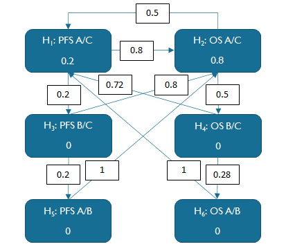

```{r, include = FALSE}
knitr::opts_chunk$set(
  collapse = TRUE,
  comment = "#>"
)
```

```{r setup}
library(lrstat)
```

## Background

Consider a phase 3 study with three arms: Arm A (drug A + drug B), Arm B (drug A placebo + drug B), and Arm C (drug A placebo + drug B placebo). Consider two endpoints: PFS and OS. There are six comparisons of interest corresponding to the combinations of two endpoints by three pairwise treatment comparisons.

## Multiplicity adjustment strategy

The overall type I error rate is to be controlled at 1-sided $\alpha=2.5\%$. The total alpha is split into 20% for PFS and 80% for OS. The following graph depicts the initial alpha allocation and propagation.



This strategy ensures that the A/B comparison will be performed for a given endpoint only if both the A/C and B/C comparisons are significant for the endpoint. This assumes that B/C comparison is likely to be effective and we are interested in assessing the contribution of components (CoC) of drug A in the drug combination A+B.

The weights along the edges are chosen to ensure that (1) about 20% of alpha will be allocated to PFS and 80% of alpha will be allocated to OS once the two hypotheses in the preceding family are rejected, and (2) if the PFS hypothesis is rejected, the majority of alpha will be passed to the OS hypothesis in the same family. This can be verified using the code below:

```{r updategraph}

alpha = 0.025
x = list(
  w = c(0.2, 0.8, 0, 0, 0, 0),
  G = matrix(c(0, 0.8, 0.2, 0, 0, 0, 
               0.5, 0, 0, 0.5, 0, 0,
               0, 0.8, 0, 0, 0.2, 0,
               0.72, 0, 0, 0, 0, 0.28,
               0, 1, 0, 0, 0, 0,
               1, 0, 0, 0, 0, 0),
             nrow=6, ncol=6, byrow = TRUE),
  I = seq(1, 6))

print(alpha*x$w, digits=4)
for (j in 1:6) {
  x = updateGraph(x$w, x$G, x$I, j)
  print(alpha*x$w, digits=4)
}

```

## Assumptions

We assume that the enrollment rate is 10 patients per month for the first 8 months and 28 patients per month thereafter. We target to enroll 700 patients in about 30 months. The randomization ratio is 2:2:1 for Arms A:B:C.

The table below displays the assumptions for the event process by endpoint and by treatment arm along with the hazard ratios for Arm A or Arm B compared with Arm C.

| Endpoint | Parameter   | Arm A | Arm B | Arm C |
|----------|-------------|-------|-------|-------|
| PFS      | Median, mos | 22    | 17    | 12    |
|          | HR vs. C    | 0.55  | 0.70  | NA    |
| OS       | Median, mos | 50    | 40    | 30    |
|          | HR vs. C    | 0.60  | 0.75  | NA    |

Table 1: Assumptions for the event process

## Group sequential design

We assume that the study has two interim looks and one final look. The comparison in PFS for Arm A vs. C will be performed at Looks 1 and 2 only, while the other five comparisons will be performed at all three looks. An HSD(-4) alpha spending function will be used for testing each of the six hypotheses.

The timing of Look 1 and Look 2 is based on the combined PFS events for Arm A and Arm C, and Look 1 has 75% PFS events relative to Look 2. In addition, we target 97% power for PFS A/C at 1-sided alpha of 0.5%.

The following code calculates the sample size for the PFS A/C comparison. Of note, the accrual intensity is 3/5 of the overall population due to the 2:2:1 randomization ratio and the fact that only Arms A and C are included for the A/C comparison. The accrual duration of 30.143 months is used to enroll 700 patients for Arms A, B and C combined.

```{r sample size calculation for PFS A/C}
(lr1 <- lrsamplesize(
  beta = 0.03, kMax = 2, informationRates = c(0.75,1), 
  alpha = 0.005, typeAlphaSpending = "sfHSD", 
  parameterAlphaSpending = -4, 
  allocationRatioPlanned = 2, 
  accrualTime = c(0,8), accrualIntensity = c(10,28)*3/5, 
  lambda1 = log(2)/22, lambda2 = log(2)/12, 
  accrualDuration = 30.143, followupTime = NA, 
  typeOfComputation = "Schoenfeld")$resultsUnderH1)

```

It can be seen that Look 1 and Look 2 are expected to take place at months 33.4 and 41.5, respectively, with the target number of events for Arm A and Arm C combined of 186 and 248 at the two looks, respectively.

We can now calculate the expected number of OS events for Arm A and Arm C combined at Look 1 and Look 2, respectively.

```{r expected number of OS events at look 1 and look 2}

(lr2a <- lrstat(
  time = lr1$byStageResults$analysisTime, 
  allocationRatioPlanned = 2,
  accrualTime = c(0,8), accrualIntensity = c(10,28)*3/5, 
  lambda1 = log(2)/50, lambda2 = log(2)/30,
  accrualDuration = 30.143, followupTime = 100,
  predictTarget = 1))

```

Look 3 is planned to have 90% power for the OS A/C comparison at 1-sided alpha of 2%, which can be done as follows:

```{r required number of OS events at look 3 for 90% power}

(d_os <- ceiling(uniroot(function(d) {
  lr <- lrsamplesize(
    beta = 0.1, kMax = 3, 
    informationRates = c(lr2a$nevents, d)/d,
    alpha = 0.020, typeAlphaSpending = "sfHSD", 
    parameterAlphaSpending = -4, 
    allocationRatioPlanned = 2, 
    accrualTime = c(0,8), 
    accrualIntensity = c(10,28)*3/5, 
    lambda1 = log(2)/50, lambda2 = log(2)/30, 
    accrualDuration = 30.143, followupTime = NA, 
    typeOfComputation = "Schoenfeld",
    rounding = 0)$resultsUnderH1
  lr$overallResults$numberOfEvents - d}, 
  c(138,300))$root))

(studyDuration = caltime(
  nevents = d_os, 
  allocationRatioPlanned = 2, 
  accrualTime = c(0,8), 
  accrualIntensity = c(10,28)*3/5, 
  lambda1 = log(2)/50, lambda2 = log(2)/30,
  accrualDuration = 30.143, followupTime = 1000))

```

In summary, the OS A/C power calculation is as follows:

```{r OS sample size}
(lr2 <- lrpower(
  kMax = 3, 
  informationRates = c(lr2a$nevents, d_os)/d_os, 
  alpha = 0.020, typeAlphaSpending = "sfHSD", 
  parameterAlphaSpending = -4, 
  allocationRatioPlanned = 2, 
  accrualTime = c(0,8), 
  accrualIntensity = c(10,28)*3/5, 
  lambda1 = log(2)/50, lambda2 = log(2)/30,
  accrualDuration = 30.143, followupTime = 25.586, 
  typeOfComputation = "Schoenfeld"))
```


Therefore, Look 3 is expected to take place at month 55.7. Based on the timing of the three looks, we obtain the expected number of events for the other four comparisons:

```{r expected number of events for other comparisons}

(lr3 <- lrstat(
  time = lr2$byStageResults$analysisTime, 
  allocationRatioPlanned = 2,
  accrualTime = c(0,8), accrualIntensity = c(10,28)*3/5, 
  lambda1 = log(2)/17, lambda2 = log(2)/12,
  accrualDuration = 30.143, followupTime = 1000,
  predictTarget = 1))


(lr4 <- lrstat(
  time = lr2$byStageResults$analysisTime, 
  allocationRatioPlanned = 2,
  accrualTime = c(0,8), accrualIntensity = c(10,28)*3/5, 
  lambda1 = log(2)/40, lambda2 = log(2)/30,
  accrualDuration = 30.143, followupTime = 1000,
  predictTarget = 1))


(lr5 <- lrstat(
  time = lr2$byStageResults$analysisTime, 
  allocationRatioPlanned = 1,
  accrualTime = c(0,8), accrualIntensity = c(10,28)*4/5, 
  lambda1 = log(2)/22, lambda2 = log(2)/17,
  accrualDuration = 30.143, followupTime = 1000,
  predictTarget = 1))


(lr6 <- lrstat(
  time = lr2$byStageResults$analysisTime, 
  allocationRatioPlanned = 1,
  accrualTime = c(0,8), accrualIntensity = c(10,28)*4/5, 
  lambda1 = log(2)/50, lambda2 = log(2)/40,
  accrualDuration = 30.143, followupTime = 1000,
  predictTarget = 1))


```

The power calculation for PFS A/C and OS A/C assumes no alpha recycling between the two hypotheses. In the presence of alpha propagation among the six hypotheses depicted in Figure 1, we resort to simulations to obtain the empirical power with multiplicity adjustment for the six hypotheses.

## Simulation and empirical power

First we simulate 500 trials, with the first 2 looks planned at 186 and 248 events for endpoint 1 and the final look planned at 196 events for endpoint 2, i.e., kMaxe1 = 2 and plannedEvents = c(186, 248, 196).

```{r simulation}

sim1 = lrsim2e3a(
  kMax = 3, 
  kMaxe1 = 2,
  allocation1 = 2, 
  allocation2 = 2, 
  allocation3 = 1,
  accrualTime = c(0, 8), 
  accrualIntensity = c(10, 28),
  lambda1e1 = log(2)/22,
  lambda2e1 = log(2)/17,
  lambda3e1 = log(2)/12,
  lambda1e2 = log(2)/50, 
  lambda2e2 = log(2)/40,
  lambda3e2 = log(2)/30,
  accrualDuration = 30.143,
  plannedEvents = c(186, 248, 196),
  maxNumberOfIterations = 500,
  maxNumberOfRawDatasetsPerStage = 1,
  seed = 314159)
```

From the summary data for each simulated data set, we obtain the pairwise total number of events and the raw p-values.

```{r simulated number of events and p-values}
library(dplyr)
library(tidyr)

df <- sim1$sumdata %>% 
  mutate(events13 = events1 + events3,
         events23 = events2 + events3,
         events12 = events1 + events2,
         p13 = pnorm(logRankStatistic13), 
         p23 = pnorm(logRankStatistic23), 
         p12 = pnorm(logRankStatistic12)) %>% 
  select(iterationNumber, stageNumber, endpoint, 
         events13, events23, events12, 
         p13, p23, p12)

dfcomp <- tibble(comparison = c("13", "23", "12"),
                 order = c(1, 2, 3))


dfinfo <- df %>% 
  arrange(iterationNumber, endpoint) %>% 
  pivot_longer(
    c("events13", "events23", "events12"), 
    names_to = "c_events", 
    values_to = "events") %>% 
  mutate(comparison = substring(c_events, 7)) %>%
  left_join(dfcomp, by = c("comparison")) %>% 
  arrange(iterationNumber, order, endpoint, 
          stageNumber)


dfp <- df %>% 
  arrange(iterationNumber, endpoint) %>% 
  pivot_longer(
    c("p13", "p23", "p12"), 
    names_to = "c_p", 
    values_to = "p") %>% 
  mutate(comparison = substring(c_p, 2)) %>%
  left_join(dfcomp, by = c("comparison")) %>% 
  arrange(iterationNumber, order, endpoint, 
          stageNumber)

```


Now we use specified alpha-spending function along with the target total number of events to adjust the critical values based on the current alpha for the hypothesis. We compare the p-values to the critical values to determine whether to reject the hypothesis at the current look. The empirical power for a hypothesis is estimated by the proportion of simulations which reject the hypothesis.  

```{r adjusted power}
w = c(0.2, 0.8, 0, 0, 0, 0) 
G = matrix(c(0, 0.8, 0.2, 0, 0, 0, 
             0.5, 0, 0, 0.5, 0, 0,
             0, 0.8, 0, 0, 0.2, 0, 
             0.72, 0, 0, 0, 0, 0.28,
             0, 1, 0, 0, 0, 0, 
             1, 0, 0, 0, 0, 0), 
           nrow=6, ncol=6, byrow=TRUE)


rejStage = fseqbon(
  w = w, G = G, alpha = 0.025, kMax = 3,
  typeAlphaSpending = rep("sfHSD", 6),
  parameterAlphaSpending = rep(-4, 6),
  incidenceMatrix = matrix(
    c(1,1,0, 1,1,1, 1,1,1, 1,1,1, 1,1,1, 1,1,1), 
    nrow=6, ncol=3, byrow=TRUE),
  maxInformation = c(248, 196, 342, 216, 413, 249),
  p = matrix(dfp$p, 3000, 3, byrow=TRUE),
  information = matrix(dfinfo$events, 3000, 3, byrow=TRUE))

reject2a = matrix(rejStage>0, nrow=500, ncol=6, byrow=TRUE)
(power2 = apply(reject2a, 2, mean))


```


